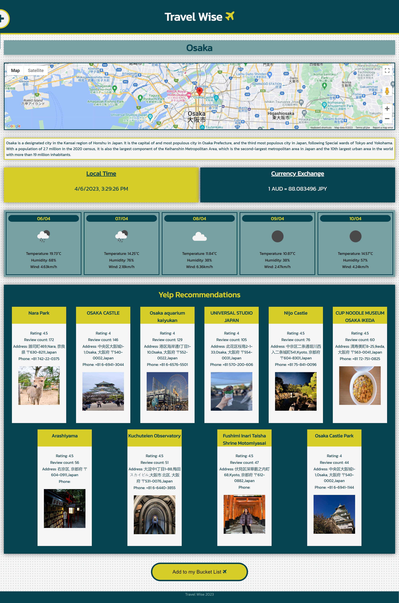

# Travel Wise
Deployed Site: https://joshua-watson96.github.io/Travel-Wise/index.html 

## Description
A website for travelers to access relevant information about destinations to help them with their travel plans, thereby facilitating the decision making process. This information includes a map of the city, local time, a short description, local currency and the exchange rate from 1AUD, 5-day weather forecast, and the top 10 recommendations for that city. Moreover, the inclusion of the bucket list enables users to save these destinations to their personally curated bucket list.
 

## Installation
To run the Yelp API (recommendations), please click and run this link prior to opening deployed site
     --------> https://cors-anywhere.herokuapp.com/corsdemo 

## Usage
Users can use the search bar on the homepage to search cities of their choice. This is also aided by autocomplete suggestions. Alternatively, they may also click on one of the images/titles presented in the 'Our Top Picks' section to navigate to those destinations. Users may also navigate to the bucket list by clicking the link in the collapsible sidebar.  

Once on a destinations info page, users can navigate through the presented information. Additionally, the cards displaying the top Yelp recommendations act as working links to that Yelp page. Like the homepage, there is a collapsile sidebar that contains links to the homepage and bucket list page. At the bottom of the page, there is a button that enables users to add the particular destination to their curated bucket list. 

When accessing the bucket list page, user will be presented with a list of their saved destinations. these may be removed using the corresponding remove button. Users may also check the checkbox if they have visitied that location. 

Home Page

Destinations Page

Destinations Page showing the side bar

Bucket List Page

## Credits
Collaborators:
https://github.com/allentpogi
https://github.com/maymyatnoehtet
https://github.com/eilismcmillan

API's used:
OpenWeather API (Weather)
Fixer API (Currency)
Yelp API (Recommendations)
Google API (Map,local Time)
Wikipedia API (Description of city)

OpenWeather API References:
https://openweathermap.org/forecast5
https://openweathermap.org/api/geocoding-api 
https://openweathermap.org/weather-conditions 

Fixer API References:
https://fixer.io/documentation
https://www.w3schools.com/whatis/whatis_ajax.asp
https://apilayer.com/marketplace/fixer-api#documentation-tab
https://apilayer.com/marketplace/fixer-api#pricing

Yelp API References:
https://docs.developer.yelp.com/docs/fusion-intro
https://stackoverflow.com/questions/53357891/how-do-i-resolve-the-cors-error-in-yelp-api-call
https://stackoverflow.com/questions/55159973/how-to-solve-this-problem-cross-origin-read-blocking-corb-blocked-cross-orig

Google API References:
https://developers.google.com/maps 
https://developers.google.com/maps/documentation/javascript 
https://developers.google.com/maps/documentation/timezone/ 
https://developers.google.com/maps/documentation/geocoding 

Wikipedia API References:
https://www.mediawiki.org/wiki/API:Get_the_contents_of_a_page

Other References:
file:///Users/maymyatnoehtet/Documents/Monash%20Coding%20Bootcamp/MONU-VIRT-FSF-PT-02-2023-U-LOLC/Week-05/Day-01/02-Stu_jQuery-Elements/Solved/assets/js/script.js
https://coolors.co/93b7be-554348-d4f5f5-8c9a9e-747578

## License
No license

